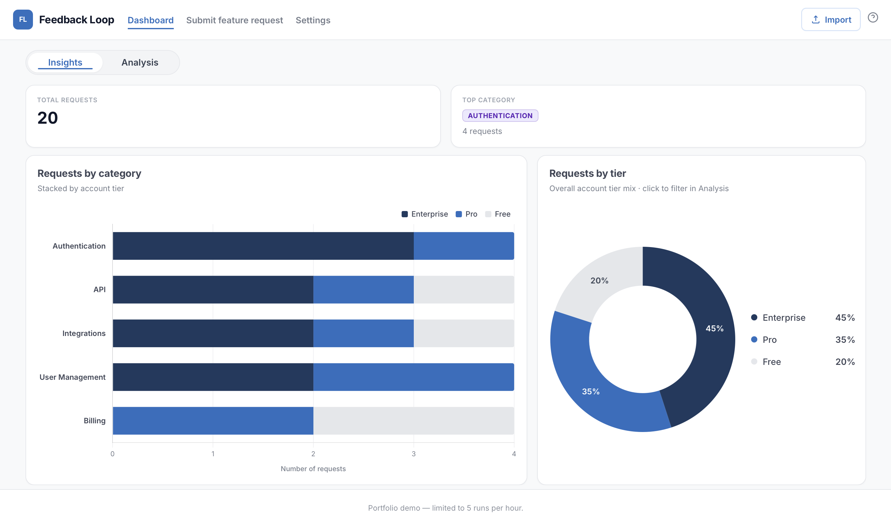
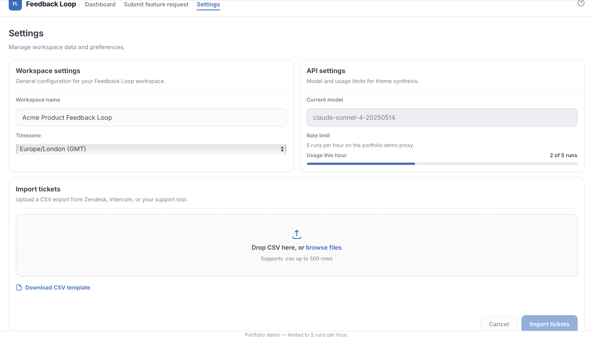
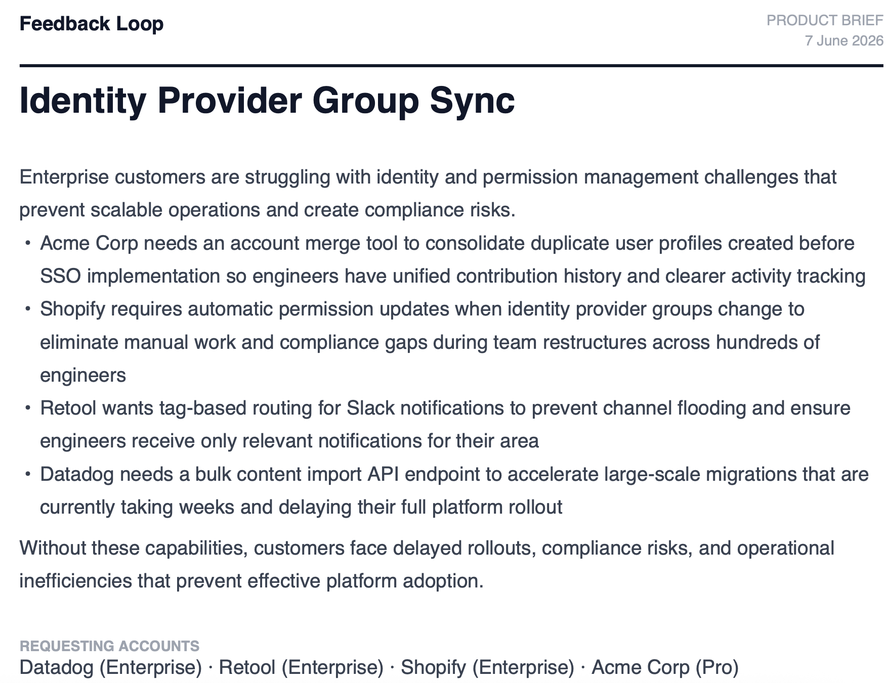

# Feedback Loop

The pattern is always the same. A customer submits a feature request, another submits the same one two weeks later, and by the end of the quarter the same request is sitting across multiple tickets from different accounts.

Someone has to manually go through every ticket, identify the pattern, and write up individual feature requests engineering can access and prioritise.

This tool changes that. Submit a request, filter the queue, run the analysis, and export a PDF document you can hand straight to engineering.

Built because when the process lives in a system, nothing falls through the gaps.

**[Live demo](https://feedback-loop.pages.dev/src/dashboard.html)** · **[Case study](https://madihaintech.me/feedback-loop.html)** · **[Source](https://github.com/KhanKMadiha/feedback-loop)**

Mock tickets are already loaded. Submit your own or use the existing ones, then open the dashboard to run the analysis and export a brief.

---

## What it does

Feedback Loop has two views: Insights and Analysis.

### Insights

A live analytics dashboard that gives you the full picture before you dive into individual tickets.

- **Summary row** — total requests, top category, most active tier, and enterprise share at a glance
- **Requests by category** — horizontal stacked bar chart showing volume per category broken down by account tier (Enterprise, Pro, Free). Click any segment to filter the Analysis view instantly
- **Requests by tier** — donut chart showing the overall tier mix with in-segment percentages
- **Request volume over time** — trend line showing whether feature request volume is growing

### Analysis

The core workflow for turning a queue of tickets into an engineering brief.

**Step 1 — Filter and select**

Filter tickets by category, account tier, priority, and date range. Select the ones you want to analyse.

**Step 2 — Analyse**

Claude groups the selected tickets into themes, scores each by priority based on frequency and account tier, and returns a summary with recommended actions and affected accounts.

**Step 3 — Export**

Download a PDF product brief with the full theme summary, affected accounts, recommended action, and supporting ticket evidence. Something engineering can open in a meeting and act on straight away.

---

## Why priority is weighted by account tier

When ten free users and one enterprise account ask for the same thing, they are not equal requests. The enterprise account has a contract, a renewal conversation, and a support engineer whose time depends on the resolution.

Feedback Loop scores priority using both frequency and account tier so the output reflects how a product team would actually prioritise, not just how many customers asked.

---

## Import your own tickets

The Settings page lets you import your own feature request data via CSV.

- Drag and drop or browse to upload
- Download the CSV template to see the expected format
- Preview your data before importing
- Import up to 500 rows
- Choose to merge with mock tickets or use your import only
- Imported tickets persist in localStorage across sessions

---

## Screenshots

### Insights tab



### Analysis tab


### Import tickets



### PDF export



---

## Built with

Cursor · JavaScript · Anthropic Claude API · Chart.js · Cloudflare Workers · Workers KV · jsPDF · Cloudflare Pages

---

## Run locally

```bash
git clone https://github.com/KhanKMadiha/feedback-loop.git
cd feedback-loop
npm start
```

Open:
- http://localhost:3000/src/submit-feature-request.html
- http://localhost:3000/src/dashboard.html

To run AI analysis locally, start the Worker proxy in a second terminal:

```bash
npm run dev:proxy
```

Copy `workers/.dev.vars.example` to `workers/.dev.vars` and add your Anthropic key:

```
ANTHROPIC_API_KEY=sk-ant-api03-your-key-here
```

Restart `npm run dev:proxy` after editing `.dev.vars`.

---

## Project structure

```
feedback-loop/
  src/
    dashboard.html        # Insights and Analysis tabs
    submit-feature-request.html  # Intake form
    settings.html         # Import and data source settings
    app.js                # Insights, import logic, analyse workflow
    styles.css            # All styling
  data/mock-tickets.json  # Sample tickets by request type
  workers/proxy.js        # Cloudflare Worker — API proxy and rate limiting
  docs/mockups/           # Recruiter-facing screenshots
```

---

## Other projects

Support Ticket Analyser: [khankmadiha.github.io/support-ticket-analyser](https://khankmadiha.github.io/support-ticket-analyser)
Articulate: [articulate-app-production.up.railway.app](https://articulate-app-production.up.railway.app)
Portfolio: [madihaintech.me](https://madihaintech.me)

---

## Licence

MIT — use and adapt freely, attribution appreciated.
