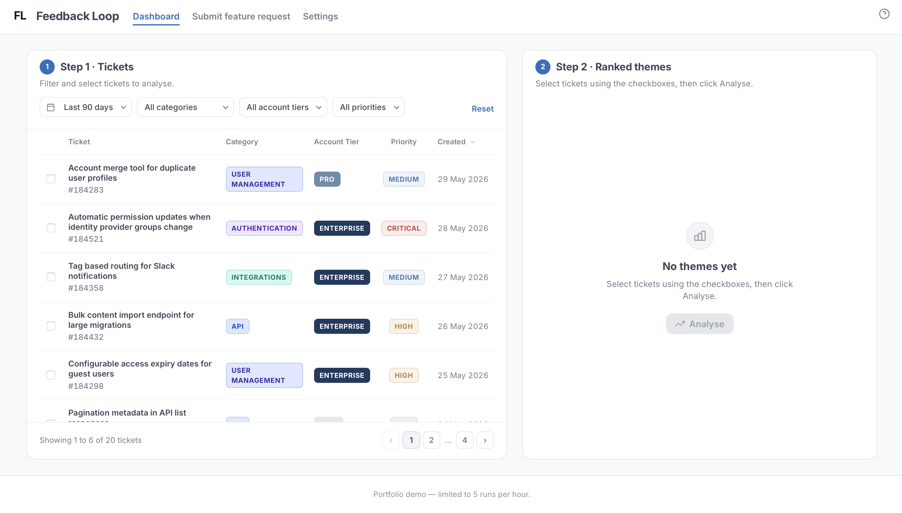
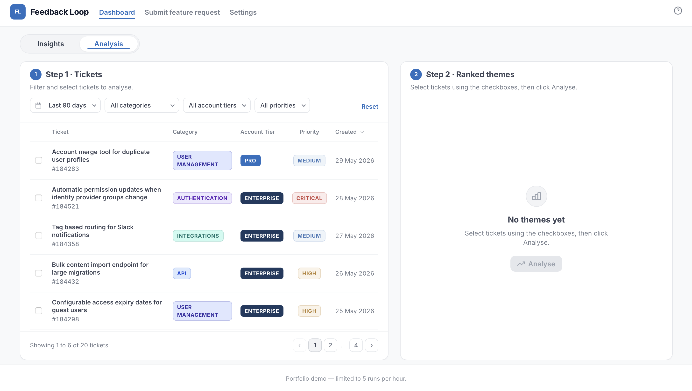

# Feedback Loop

The pattern is always the same. A customer submits a feature request, another submits the same one two weeks later, and by the end of the quarter the same request is sitting across multiple tickets from different accounts.

Someone has to manually go through every ticket, identify the pattern, and write up individual feature requests engineering can access and prioritise.

This tool changes that. Submit a request, filter the queue, run the analysis, and export a PDF document you can hand straight to engineering.

Built because when the process lives in a system, nothing falls through the gaps.

**[Live demo](https://feedback-loop.pages.dev/src/dashboard.html)** · **[Case study](https://madihaintech.me/feedback-loop.html)** · **[Source](https://github.com/KhanKMadiha/feedback-loop)**

Mock tickets are already loaded. Submit your own or use the existing ones, then open the dashboard to run the analysis and export a brief.

---

## How it works

**Step 1 — Submit and filter**

Log feature requests by request type (Authentication, API, Integrations, User Management, Billing) and account tier (Enterprise, Pro, Free). Filter the queue by type and account, then select the tickets you want to analyse.

**Step 2 — Analyse**

Claude groups the selected tickets into themes, scores each by priority based on how frequently it appears and which account tiers are asking for it, and returns a summary with recommended actions and affected accounts.

**Step 3 — Export**

Download a PDF document with the full brief and supporting evidence for each ticket. The document includes a theme summary, the accounts affected, a recommended action for engineering, and a breakdown of each ticket with the feature request and why it matters to the customer.

---

## Screenshots

### Dashboard



### Analysis results



### PDF export


---

## Why priority is weighted by account tier

When ten free users and one enterprise account ask for the same thing, they are not equal requests. The enterprise account has a contract, a renewal conversation, and a support engineer whose time depends on the resolution.

Feedback Loop scores priority using both frequency and account tier so the output reflects how a product team would actually prioritise, not just how many customers asked.

---

## Built with

Cursor · JavaScript · Anthropic Claude API · Cloudflare Workers · Workers KV · jsPDF · Cloudflare Pages

---

## Run locally

```bash
git clone https://github.com/KhanKMadiha/feedback-loop.git
cd feedback-loop
npm start
```

Open:
- http://localhost:3000/src/submit-feature-request.html
- http://localhost:3000/src/dashboard.html

To run AI analysis locally, start the Worker proxy in a second terminal:

```bash
npm run dev:proxy
```

Copy `workers/.dev.vars.example` to `workers/.dev.vars` and add your Anthropic key:

```
ANTHROPIC_API_KEY=sk-ant-api03-your-key-here
```

Restart `npm run dev:proxy` after editing `.dev.vars`.

---

## Project structure

```
feedback-loop/
  data/mock-tickets.json   # Sample tickets by request type
  src/                     # Dashboard, intake form, settings
  workers/proxy.js         # Cloudflare Worker — API proxy and rate limiting
```

---

## Other projects

Support Ticket Analyser: [khankmadiha.github.io/support-ticket-analyser](https://khankmadiha.github.io/support-ticket-analyser)
Articulate: [articulate-app-production.up.railway.app](https://articulate-app-production.up.railway.app)
Portfolio: [madihaintech.me](https://madihaintech.me)

---

## Licence

MIT — use and adapt freely, attribution appreciated.
